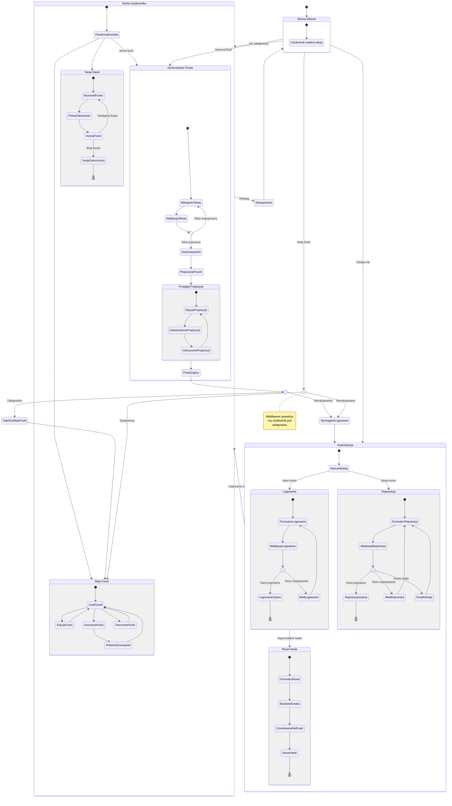

# Diagram podróży użytkownika - 10x-cards

<user_journey_analysis>

## 1. Ścieżki użytkownika z PRD

### US-001: Rejestracja konta
- Nowy użytkownik → Formularz rejestracji → Walidacja → Konto aktywne → Zalogowany

### US-002: Logowanie
- Zarejestrowany użytkownik → Formularz logowania → Weryfikacja → Zalogowany
- Zapomniałem hasła → Reset hasła → Email → Nowe hasło

### US-003: Generowanie fiszek (publiczne)
- Dowolny użytkownik → Wklejenie tekstu → Generowanie AI → Propozycje fiszek

### US-004: Zatwierdzanie propozycji
- Przegląd propozycji → Edycja/Zatwierdzenie → Próba zapisu
- Niezalogowany → Przekierowanie do logowania
- Zalogowany → Zapis do bazy

### US-005, US-006, US-007: Zarządzanie fiszkami (chronione)
- Zalogowany → Moje fiszki → Edycja/Usuwanie/Tworzenie

### US-008: Sesja nauki (chroniona)
- Zalogowany → Sesja nauki → Algorytm powtórek → Ocena

### US-009: Bezpieczny dostęp
- Próba dostępu do chronionych zasobów bez logowania → Przekierowanie

## 2. Główne podróże

| Podróż | Stan początkowy | Stan końcowy |
|--------|-----------------|--------------|
| Rejestracja | Nowy użytkownik | Zalogowany |
| Logowanie | Niezalogowany | Zalogowany |
| Generowanie | Dowolny | Propozycje fiszek |
| Zapis fiszek | Zalogowany | Moje fiszki |
| Nauka | Zalogowany | Sesja zakończona |

## 3. Punkty decyzyjne

- Czy użytkownik jest zalogowany?
- Czy dane są poprawne?
- Czy email istnieje w systemie?
- Czy użytkownik chce zapisać fiszki?
- Czy sesja wygasła?

## 4. Cele stanów

- **Strona główna**: Punkt wejścia, wybór akcji
- **Generowanie**: Tworzenie propozycji fiszek (publiczne)
- **Logowanie/Rejestracja**: Uzyskanie dostępu do funkcji chronionych
- **Moje fiszki**: Zarządzanie zapisanymi fiszkami
- **Sesja nauki**: Nauka z algorytmem powtórek
- **Reset hasła**: Odzyskanie dostępu do konta

</user_journey_analysis>

<mermaid_diagram>



</mermaid_diagram>

## Podsumowanie podróży użytkownika

### Ścieżka niezalogowanego użytkownika

```
Strona Główna → Generowanie → Propozycje → Próba zapisu → Logowanie/Rejestracja → Zapis
```

### Ścieżka zalogowanego użytkownika

```
Strona Główna → Moje Fiszki / Sesja Nauki / Generowanie
```

### Punkty przekierowania

| Akcja | Niezalogowany | Zalogowany |
|-------|---------------|------------|
| Generowanie fiszek | ✅ Dozwolone | ✅ Dozwolone |
| Zapis fiszek | ❌ → Logowanie | ✅ Dozwolone |
| Moje fiszki | ❌ → Logowanie | ✅ Dozwolone |
| Sesja nauki | ❌ → Logowanie | ✅ Dozwolone |
| Edycja fiszek | ❌ → Logowanie | ✅ Dozwolone |

## Kluczowe decyzje UX

1. **Niski próg wejścia** - generowanie bez logowania
2. **Motywacja do rejestracji** - zapis wymaga konta
3. **Zachowanie stanu** - propozycje nie są tracone przy przekierowaniu
4. **Jasne komunikaty** - użytkownik wie dlaczego musi się zalogować

