# Diagram architektury UI - 10x-cards

<architecture_analysis>

## 1. Komponenty wymienione w dokumentacji

### Strony Astro (istniejące):
- `Layout.astro` - główny układ aplikacji
- `index.astro` - strona główna
- `generate.astro` - strona generowania fiszek (publiczna)
- `flashcards.astro` - strona "Moje fiszki" (chroniona)
- `login.astro` - stara strona logowania (do usunięcia)

### Strony Astro (nowe):
- `auth/login.astro` - strona logowania
- `auth/signup.astro` - strona rejestracji
- `auth/reset-password.astro` - strona resetowania hasła
- `study.astro` - strona sesji nauki (chroniona)

### Komponenty React (istniejące):
- `GenerateView.tsx` - widok generowania fiszek
- `FlashcardsView.tsx` - widok listy fiszek
- `TextAreaInput.tsx` - pole tekstowe
- `GenerateButton.tsx` - przycisk generowania
- `ProposalsList.tsx` - lista propozycji
- `ProposalCard.tsx` - karta propozycji
- `BulkSaveButton.tsx` - przycisk masowego zapisu
- `FlashcardCard.tsx` - karta fiszki
- `EditFlashcardModal.tsx` - modal edycji
- `CreateFlashcardModal.tsx` - modal tworzenia

### Komponenty React (nowe):
- `Topbar.tsx` - nawigacja z przyciskami auth
- `auth/LoginForm.tsx` - formularz logowania
- `auth/SignupForm.tsx` - formularz rejestracji
- `auth/ResetPasswordForm.tsx` - formularz resetowania hasła
- `StudyView.tsx` - widok sesji nauki

### Moduły stanu i serwisy:
- `authStore.ts` - stan użytkownika (Zustand)
- `useGenerateFlashcards.ts` - hook generowania
- `useFlashcards.ts` - hook zarządzania fiszkami

## 2. Główne strony i komponenty

| Strona | Komponent React | Dostęp |
|--------|-----------------|--------|
| /generate | GenerateView | Publiczny |
| /flashcards | FlashcardsView | Chroniony |
| /study | StudyView | Chroniony |
| /auth/login | LoginForm | Publiczny |
| /auth/signup | SignupForm | Publiczny |
| /auth/reset-password | ResetPasswordForm | Publiczny |

## 3. Przepływ danych

- Layout.astro → Topbar (props: user) → authStore (Zustand)
- GenerateView → useGenerateFlashcards → API /generations
- GenerateView → authStore (sprawdzenie przy zapisie) → API /flashcards
- FlashcardsView → useFlashcards → API /flashcards
- LoginForm → API /auth/login → authStore
- SignupForm → API /auth/signup → authStore

## 4. Funkcjonalności komponentów

- **Topbar**: Nawigacja, przyciski auth, menu użytkownika
- **GenerateView**: Generowanie fiszek AI, sprawdzenie auth przy zapisie
- **FlashcardsView**: CRUD fiszek, paginacja
- **StudyView**: Sesja nauki z algorytmem powtórek
- **LoginForm**: Walidacja, logowanie, link do rejestracji
- **SignupForm**: Walidacja, rejestracja, link do logowania
- **authStore**: Stan użytkownika, akcje auth

```mermaid
flowchart TD
    subgraph "Warstwa Layoutu"
        Layout["Layout.astro"]
        Topbar["Topbar.tsx<br/>NOWY"]
    end

    subgraph "Strony Publiczne"
        Index["index.astro<br/>Strona główna"]
        Generate["generate.astro<br/>Generowanie fiszek"]
        
        subgraph "Moduł Autentykacji - NOWY"
            AuthLogin["auth/login.astro"]
            AuthSignup["auth/signup.astro"]
            AuthReset["auth/reset-password.astro"]
        end
    end

    subgraph "Strony Chronione"
        Flashcards["flashcards.astro<br/>Moje fiszki"]
        Study["study.astro<br/>Sesja nauki - NOWY"]
    end

    subgraph "Komponenty React - Generowanie"
        GenerateView["GenerateView.tsx<br/>AKTUALIZACJA"]
        TextAreaInput["TextAreaInput.tsx"]
        GenerateButton["GenerateButton.tsx"]
        ProposalsList["ProposalsList.tsx"]
        ProposalCard["ProposalCard.tsx"]
        BulkSaveButton["BulkSaveButton.tsx"]
    end

    subgraph "Komponenty React - Fiszki"
        FlashcardsView["FlashcardsView.tsx"]
        FlashcardCard["FlashcardCard.tsx"]
        EditModal["EditFlashcardModal.tsx"]
        CreateModal["CreateFlashcardModal.tsx"]
    end

    subgraph "Komponenty React - Auth - NOWE"
        LoginForm["LoginForm.tsx"]
        SignupForm["SignupForm.tsx"]
        ResetForm["ResetPasswordForm.tsx"]
    end

    subgraph "Komponenty React - Nauka - NOWY"
        StudyView["StudyView.tsx"]
    end

    subgraph "Zarządzanie Stanem"
        AuthStore["authStore.ts<br/>Zustand - NOWY"]
        UseGenerate["useGenerateFlashcards.ts"]
        UseFlashcards["useFlashcards.ts"]
    end

    subgraph "Middleware i API"
        Middleware["middleware/index.ts<br/>AKTUALIZACJA"]
        
        subgraph "API Auth - NOWE"
            APILogin["api/auth/login.ts"]
            APISignup["api/auth/signup.ts"]
            APILogout["api/auth/logout.ts"]
            APIReset["api/auth/reset-password.ts"]
            APIDelete["api/auth/delete-account.ts"]
        end
        
        subgraph "API Flashcards"
            APIFlashcards["api/flashcards.ts"]
            APIGenerations["api/generations.ts"]
        end
    end

    subgraph "Supabase"
        SupabaseAuth["Supabase Auth"]
        SupabaseDB["Supabase Database"]
    end

    %% Połączenia Layout
    Layout --> Topbar
    Layout --> Index
    Layout --> Generate
    Layout --> Flashcards
    Layout --> Study
    Layout --> AuthLogin
    Layout --> AuthSignup
    Layout --> AuthReset

    %% Połączenia Topbar
    Topbar -.->|"user props"| AuthStore

    %% Połączenia stron z komponentami
    Generate --> GenerateView
    Flashcards --> FlashcardsView
    Study --> StudyView
    AuthLogin --> LoginForm
    AuthSignup --> SignupForm
    AuthReset --> ResetForm

    %% Połączenia GenerateView
    GenerateView --> TextAreaInput
    GenerateView --> GenerateButton
    GenerateView --> ProposalsList
    GenerateView --> BulkSaveButton
    GenerateView -.->|"sprawdź auth"| AuthStore
    ProposalsList --> ProposalCard

    %% Połączenia FlashcardsView
    FlashcardsView --> FlashcardCard
    FlashcardsView --> EditModal
    FlashcardsView --> CreateModal

    %% Połączenia hooków
    GenerateView --> UseGenerate
    FlashcardsView --> UseFlashcards
    UseGenerate --> APIGenerations
    UseFlashcards --> APIFlashcards
    UseGenerate -.->|"zapis"| APIFlashcards

    %% Połączenia formularzy auth
    LoginForm --> APILogin
    SignupForm --> APISignup
    ResetForm --> APIReset
    LoginForm -.->|"aktualizuj"| AuthStore
    SignupForm -.->|"aktualizuj"| AuthStore

    %% Połączenia Middleware
    Middleware ==>|"weryfikacja sesji"| SupabaseAuth
    Middleware -.->|"ochrona"| Flashcards
    Middleware -.->|"ochrona"| Study
    Middleware -.->|"ochrona"| APIFlashcards

    %% Połączenia API z Supabase
    APILogin --> SupabaseAuth
    APISignup --> SupabaseAuth
    APILogout --> SupabaseAuth
    APIReset --> SupabaseAuth
    APIDelete --> SupabaseAuth
    APIDelete --> SupabaseDB
    APIFlashcards --> SupabaseDB
    APIGenerations --> SupabaseDB

    %% Style
    classDef newComponent fill:#90EE90,stroke:#228B22,stroke-width:2px;
    classDef updateComponent fill:#FFD700,stroke:#DAA520,stroke-width:2px;
    classDef protectedPage fill:#FFB6C1,stroke:#FF69B4,stroke-width:2px;

    class Topbar,AuthLogin,AuthSignup,AuthReset,LoginForm,SignupForm,ResetForm,AuthStore,Study,StudyView,APILogin,APISignup,APILogout,APIReset,APIDelete newComponent;
    class GenerateView,Middleware updateComponent;
    class Flashcards,Study protectedPage;
```

</architecture_analysis>

<mermaid_diagram>

</mermaid_diagram>

## Legenda

| Kolor | Znaczenie |
|-------|-----------|
| 🟢 Zielony | Nowy komponent |
| 🟡 Żółty | Komponent do aktualizacji |
| 🔴 Różowy | Strona chroniona (wymaga logowania) |

## Kluczowe zmiany

1. **Layout.astro** - dodanie Topbar z przyciskami auth
2. **GenerateView.tsx** - sprawdzanie autoryzacji przy zapisie fiszek
3. **middleware/index.ts** - weryfikacja sesji JWT, ochrona tras
4. **Nowy moduł auth** - strony, formularze, API endpoints
5. **authStore** - globalny stan użytkownika (Zustand)

